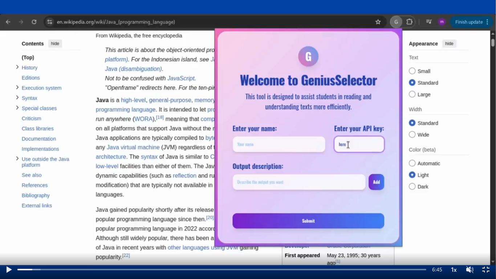

# Genius Selector: Magic at Your Fingertips

## Overview

**Genius Selector** is a Chrome extension designed to empower students and readers by making text comprehension faster, smarter, and more interactive. With a beautiful, modern interface and seamless integration, Genius Selector leverages advanced AI to help you understand, summarize, or transform selected text on any webpage.

## Features

- **Instant Text Analysis:** Select any text on a webpage and instantly get AI-powered insights, summaries, or transformations in a stylish floating box.
- **Customizable Output:** Define your own output parameters for the AI, tailoring responses to your study or research needs.
- **Secure API Integration:** Easily add and manage your HuggingFace API key for secure and personalized AI access.
- **User-Friendly Interface:** A visually appealing popup lets you enter your name, API key, and desired output parameters with ease.
- **Effortless Configuration:** Save your preferences and parameters for quick access every time you use the extension.
- **Responsive Design:** Works smoothly across devices and screen sizes, with a modern look powered by Tailwind CSS.

## Why Genius Selector Matters

In today's fast-paced digital world, students and lifelong learners face information overload. Genius Selector bridges the gap between raw information and meaningful understanding, making reading and research more efficient and enjoyable. By harnessing AI, it transforms passive reading into an interactive, personalized learning experience.

## How It Works

1. **Configure Your Preferences:** Open the extension popup, enter your name, API key, and output parameters.
2. **Select Text:** Highlight any text on a webpage.
3. **Get Results:** A floating box appears with AI-generated insights, formatted for clarity and readability.
4. **Customize Further:** Add or remove output parameters to refine the AI's responses.

## Installation

1. Download or clone this repository.
2. Go to `chrome://extensions/` in your browser.
3. Enable "Developer mode".
4. Click "Load unpacked" and select the extension folder.

## Usage

- Click the Genius Selector icon in your Chrome toolbar.
- Enter your details and desired output parameters.
- Select text on any webpage to see the magic happen!

## Technologies Used

- **Tailwind CSS** for modern, responsive styling.
- **HuggingFace API** for advanced AI text processing.
- **Chrome Extension APIs** for seamless browser integration.

## Screenshot

---

**Genius Selector**: Select, and do the Magic!

---
Copyright © 2025, All Rights Reserved For ELKADDI-Solutions